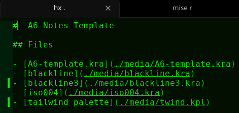
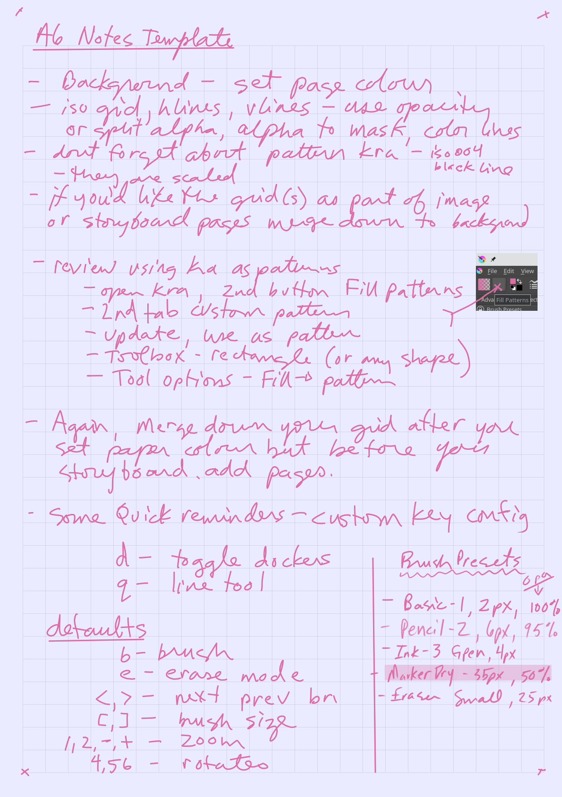
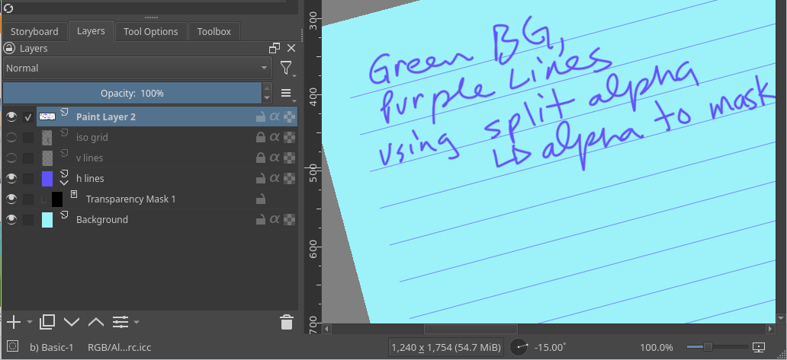
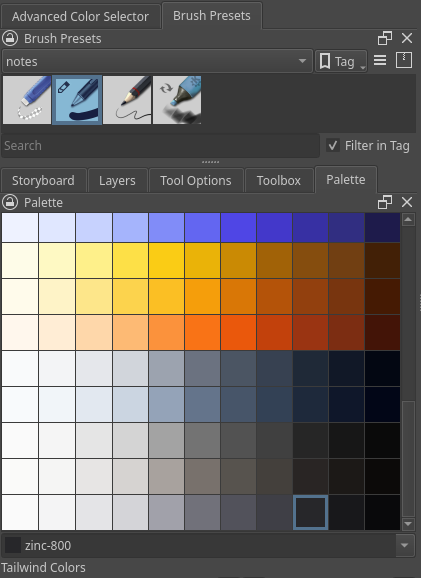

#  A6 Notes Template

Wed 11 Feb 2026 08:54:20 AM MST

## Files

- [A6-template.kra](./media/A6-template.kra)
- [blackline](./media/blackline.kra)
- [blackline3](./media/blackline3.kra)
- [iso004](./media/iso004.kra)
- [tailwind palette](./media/twind.kpl)

## Messy Example

## About the A6 Template

### Method 1,
- Shade of grey lines, Any background color, Storyboard has lines

1. Set background fill
2. Select grid lines and set layer opacity
3. Merge lines down to background
4. Add Storyboard pages

### Method 2,
- Any Color lines, Any background, Storyboard has lines

1. Set background fill
2. Choose your grid layers, say you want hlines, keep the
   other lines layers hidden
3. Right click layer, select split alpha, alpha to mask
4. This creates a sub layer that masks out everything but
   the line, so now we color the lines, on the top layer
5. Color the layer, however you like, rainbow if you want 
6. Merge layer down
7. Add Storyboard pages

## Using kra as pattern

### Set the pattern

1. Open the pattern file, ie blackline3
2. Open Fill Patterns dialog from toolbar, Fill Patterns
3. Select 2nd tab labeled Custom Pattern
4. Click Update button (from drawing)
5. Click Use as pattern button (shows in Fill Pattern toolbar now)

### Use pattern

6. Pick a shape tool, rectangle probably
7. Set Tool options, (must have docker Tool Options open)
   - set Fill --> pattern
   - set scale (50 percent)
   - set rotation, 90 for vert, btw, you can type in the slider
   - outline, keeping in mind your current brush
   
8. Ensure layer opacity
9. Ensure not erase mode, or eraser 
   - unless you want a negative pattern, then, ignore

## Defaults Rant

> quick keys should be single keystrokes, for instance, undo needs
> to be simply z, not ctrl-z, that is my long rant

### My Custom Keys for Notes

- d : toggle dockers
- q : line tool
- z : undo

### Defaults that are relevant

- b : brush
- e : erase mode
- <,> : next prev brush
- 1,2,-,+ : zoom
- 4,5,6 : rotate
- [,] : brush size

### Notes on brush palettes

- next and previous brush keys depend on which brush palette you
  have selected in the toolbar, for notes, I have only 5 brushes

   1. Basic-1, 2px, 95% opacity
   2. Pencil-2, 6px, 95%
   3. Ink-3 Gpen, 4px
   4. MarkerDry, 35px, 50% opacity
   5. Eraser Small, 25px

### Required Dockers

1. Palette
2. Toolbox
3. Tool Options
4. Layers
5. Storyboard
6. Advanced Color Selector
7. Brush Presets

2026-02-10

