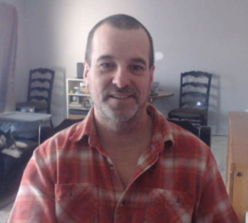

#  Welcome 

Greetings, Peace to you and your loved ones.

I am Darrell Dupas, a software developer, gamer, labourer and parent.

I’ve worked as a Technical Trainer, Technician, Desktop Support Specialist, Web Developer, GIS Developer and Database Developer. I have also worked in construction, energy and forestry: mostly as labour. I planted trees, spanning more than 20 years and over a million trees - I know that some are alive because I walk my dog by them.

The video games I love most are Shisen-Sho and War Brokers. You might have found me through my War Brokers clan name, [FISH] Milan Kundera. I've also created small games and data-mining Discord bots. I also spend a lot of time doodling in Krita.

Lately, I've been levelling up my coding setup and trying a few new things, like Devcontainers, Mise, Juijitsu, Helix, Mdbook, Krita and Nushell.

I first used Linux in mid 90's, Slackware on an Infomagic CD set. I never got XFree to work, nor the modem, but I did use vi, make, and gcc. From there, I moved over to Debian for some time, then Arch, and now I live with Debian, CachyOS, and Alpine.

My current hobby projects are a Love2D game called FSpace, and I am starting a website project that might be an e-commerce site, because I need to put some donairs in the belly.

All this and I haven’t mentioned my grown-up children and my dog. They would be horrified to know the least cool Dad in the world is on here making a blog.

I thrive on appreciation, please, follow my socials and star my repos. TODO link to socials:

[github.com/dirtslayer](github.com/dirtslayer)

zulip
email